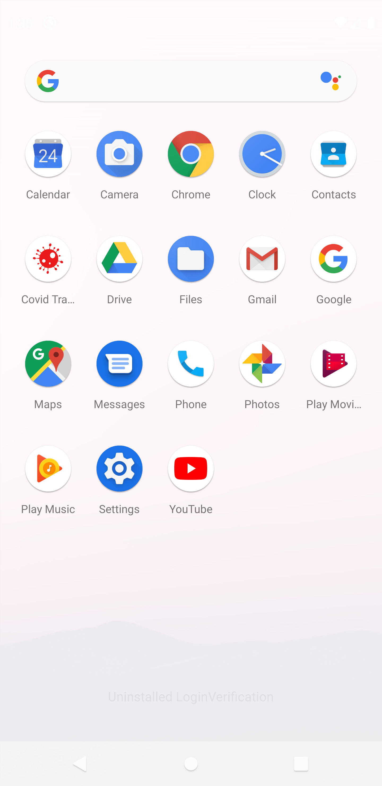

# Covid-Tracker

## Description
*Corona Tracker is an Android application which shows worldwide data of confirmed cases, recovered cases and death cases. You can also get country-wise data.
*The data is provided by https://corona.lmao.ninja/.

## Screenshots
### SplashScreen

### HomeScreen

### Country wise data

### Search Bar 
 

### Selected country data

### Application Icon

